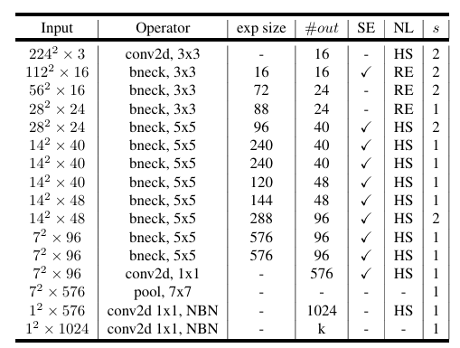
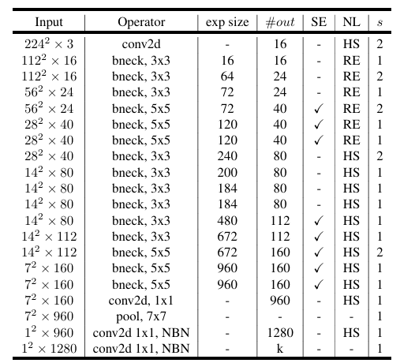
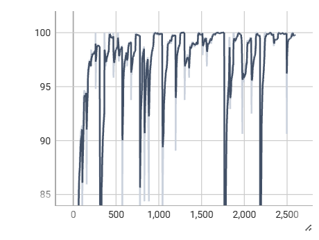
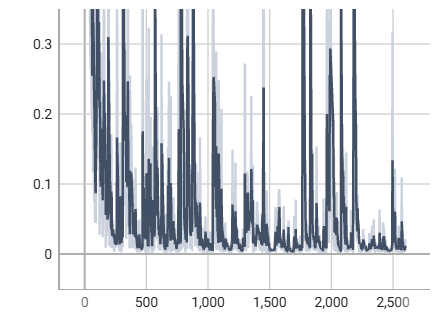
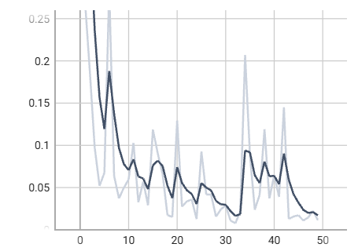
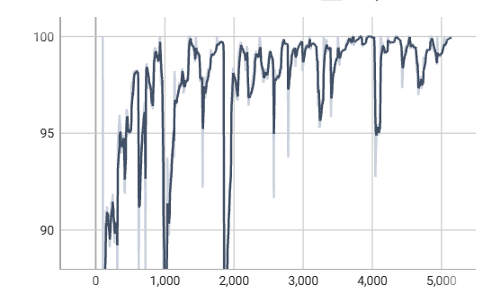
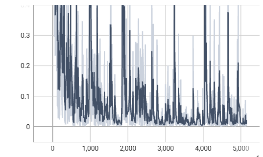
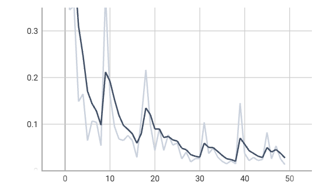

# A disasters classification project using **MobileNet V3**
We conduct a classification for images of disasters taken by drones, using [MobileNet V3](https://arxiv.org/abs/1905.02244), allowing for the possibility of lightweight deployment on drone systems.<br><br>
**Project:**<br>
[College Students' Innovation training Project of Hunan Province: Research on Multi-Modal Embodied Intelligent Agents for Emergency Rescue with Drones](https://sczx.hnu.edu.cn/info/1053/3722.htm)<br><br>
**Conductor:**<br>
[Haojun Tang](https://donaldtrump-coder.github.io/), [Yuyang Wu](https://github.com/neil666-com), [Jiahao Zhou](https://github.com/Jeiluo), [Zhiming Zhang](https://github.com/ZZM-LAB), Haipeng Tao<br>

### Paper of MobileNet V3:
[Searching for MobileNetV3](https://arxiv.org/abs/1905.02244)

### Run
#### Environment
Windows 10, Ubuntu 22.04<br>
CUDA 12.4
#### Build for the project
```
conda create -n mobilenet python=3.9
conda activate mobilenet
pip install torch==2.6.0 torchvision==0.21.0 torchaudio==2.6.0 --index-url https://download.pytorch.org/whl/cu124
pip install -r requirements.txt
```
<mark>Download the data and change the data folder name into "data" in the project directory.</mark><br>

#### Run with the config file (Take example of mobilenetv3_small model)
```
python ./main.py --config ./configs/simple_configs.yaml
```

### Dataset
We use a disaster classification images dataset: [DisasterClassification](https://www.modelscope.cn/datasets/Donald123456/DisasterClassification) to train and test the model. The dataset contains 2050 images of 8 classes of disasters, including collapse, crash, earthquake, fire, flood, snow, tornado, and war.

### Model
We use MobileNet V3 model, including MobileNet V3-Small and MobileNet V3-Large. The structure of both is shown below:

|  |  |
|:-------:|:-------:|
| MobileNet V3-Small    | MobileNet V3-Large    |

We use batch_size of 32 for MobileNet V3-Small and 16 for MobileNet V3-Large. We use NAdam optimizer with a learning rate of 0.001 for both models. We also use train proportion of 80 and epoch_num of 50.

### Results
**MobilenetV3_small:**<br>
Test Accuracy: **99.76%**<br>
charts:

| training accuracy | training_loss | epoch_loss |
|:-------:|:-------:|:-------:|
|  |  |  |

**MobilenetV3_large:**<br>
Test Accuracy: **99.51%**<br>
charts:

| training accuracy | training_loss | epoch_loss |
|:-------:|:-------:|:-------:|
|  |  |  |